# 业火五笔输入法


[](https://app.fossa.com/projects/git%2Bgithub.com%2Fqwertyyb%2FFire?ref=badge_shield)


## 💰 打赏支持
如果本项目对你有帮助，欢迎请作者喝杯咖啡，你的支持是持续更新的动力~

| 微信 | 支付宝 |
| ---- | ---- |
|  |  |

## 介绍

轻量干净，但功能强大的五笔输入法

## 截图

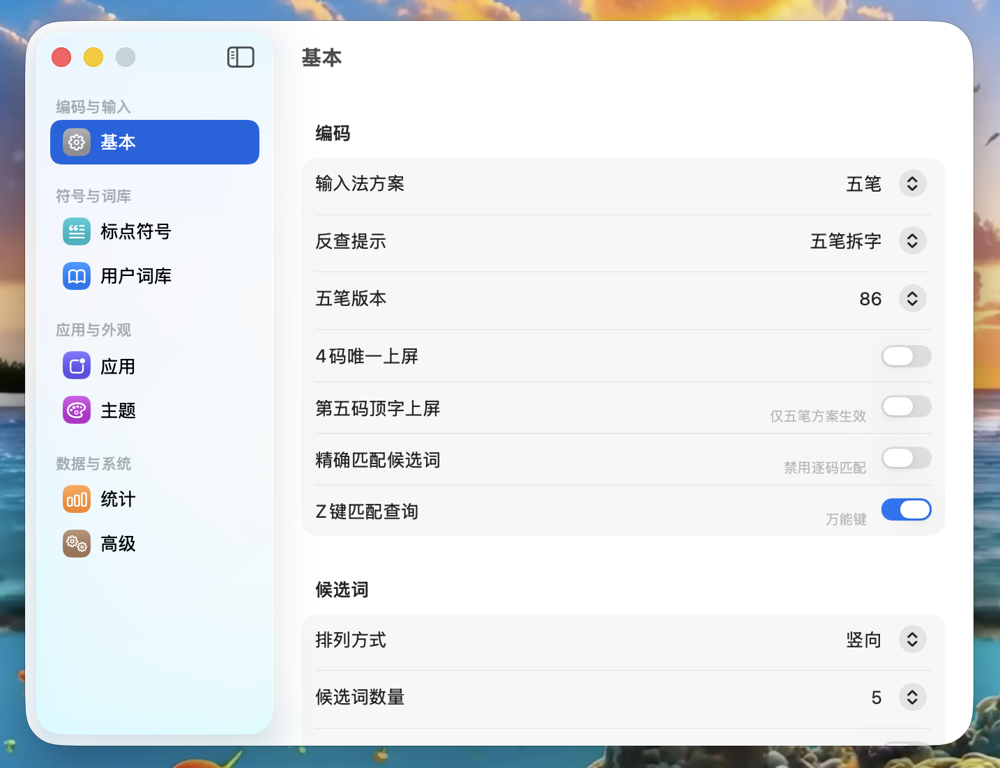

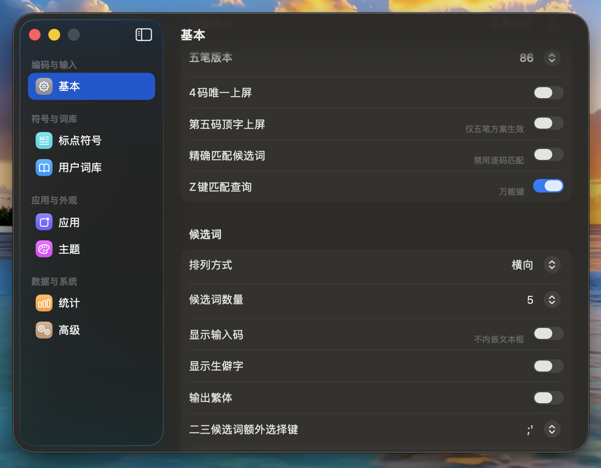

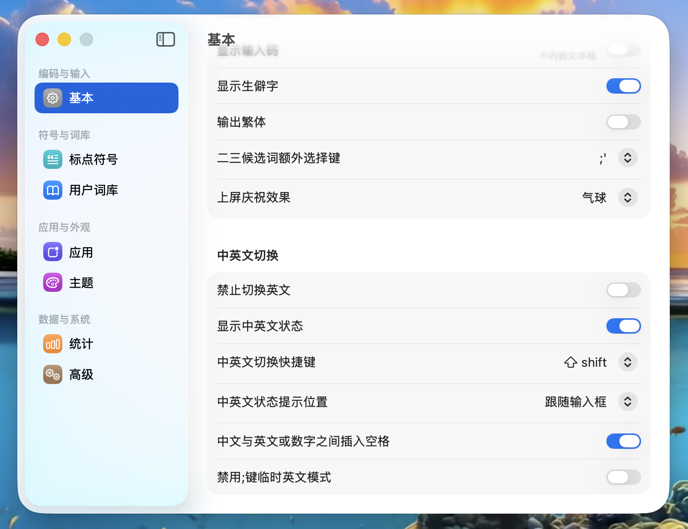

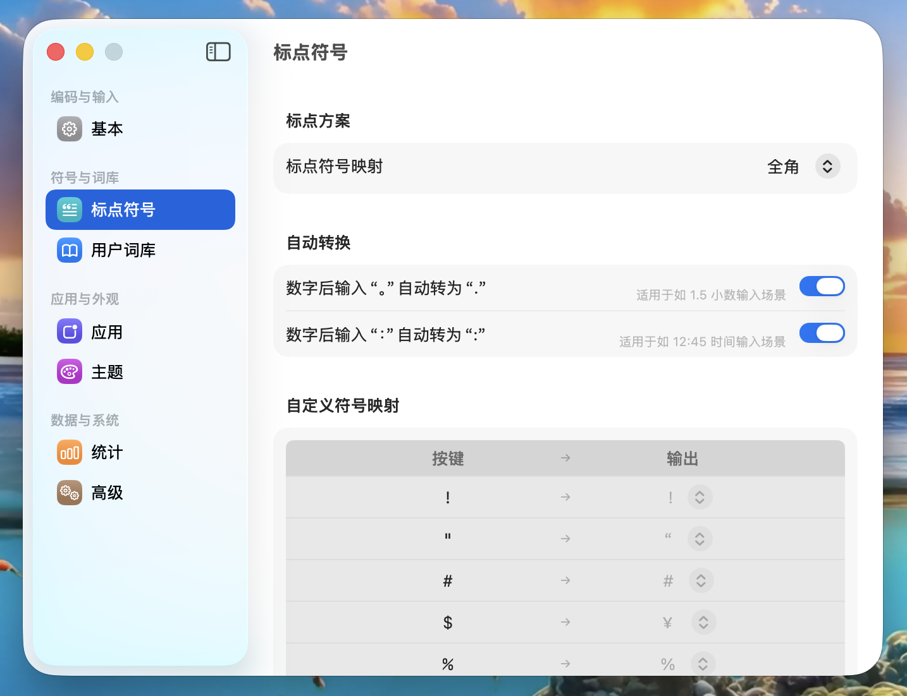

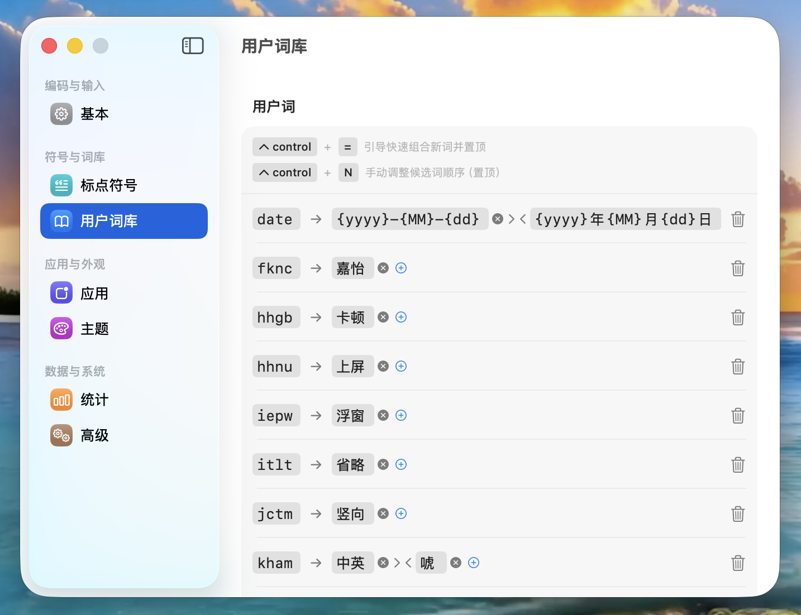

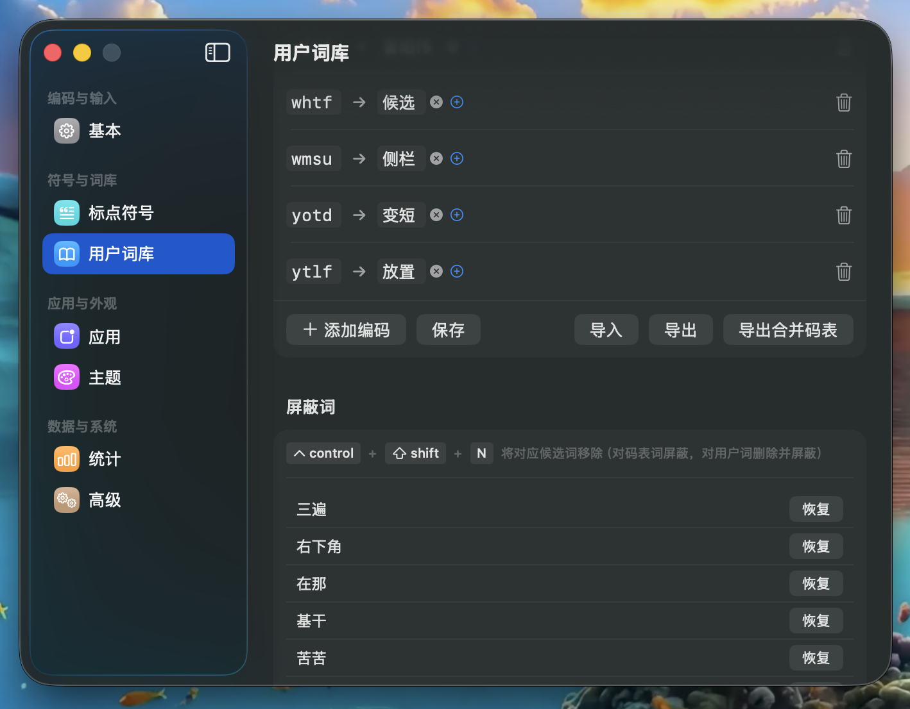

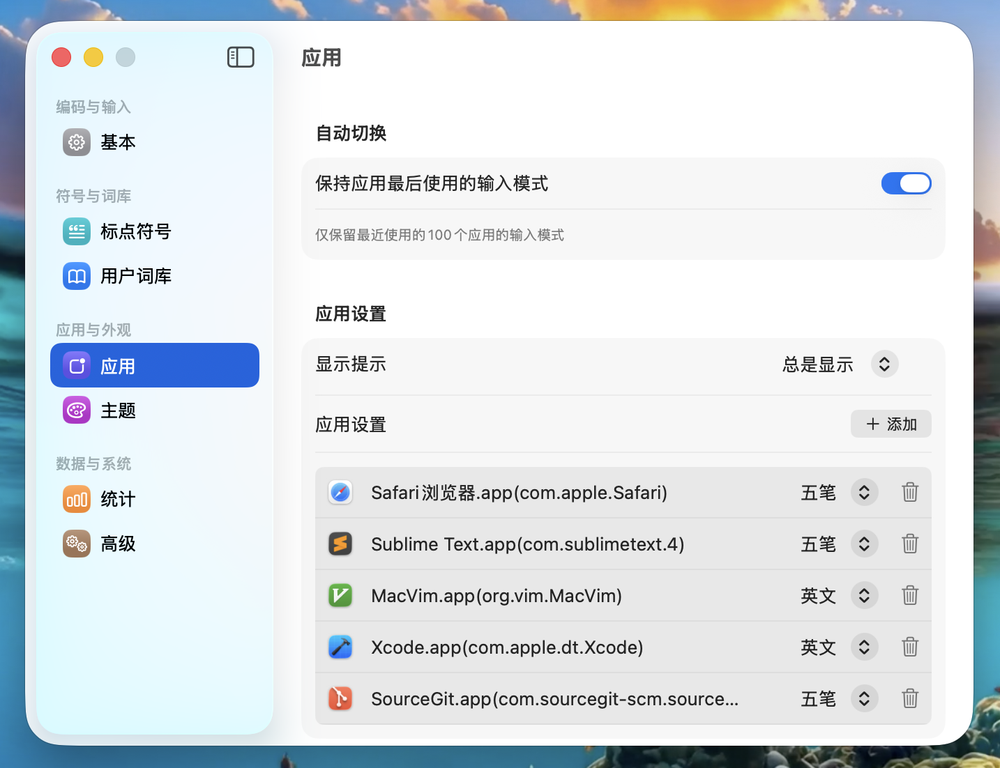

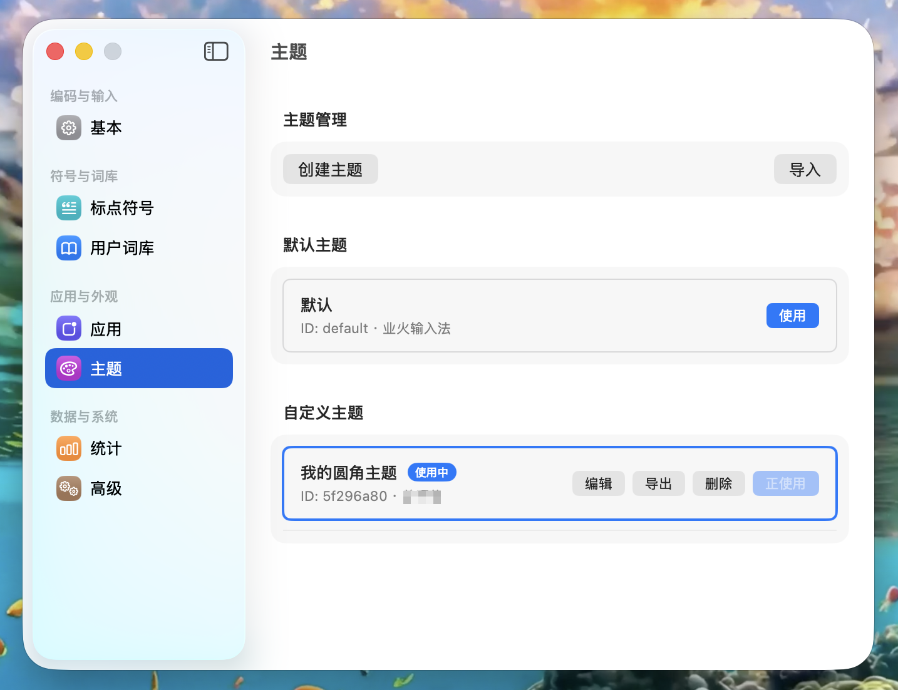

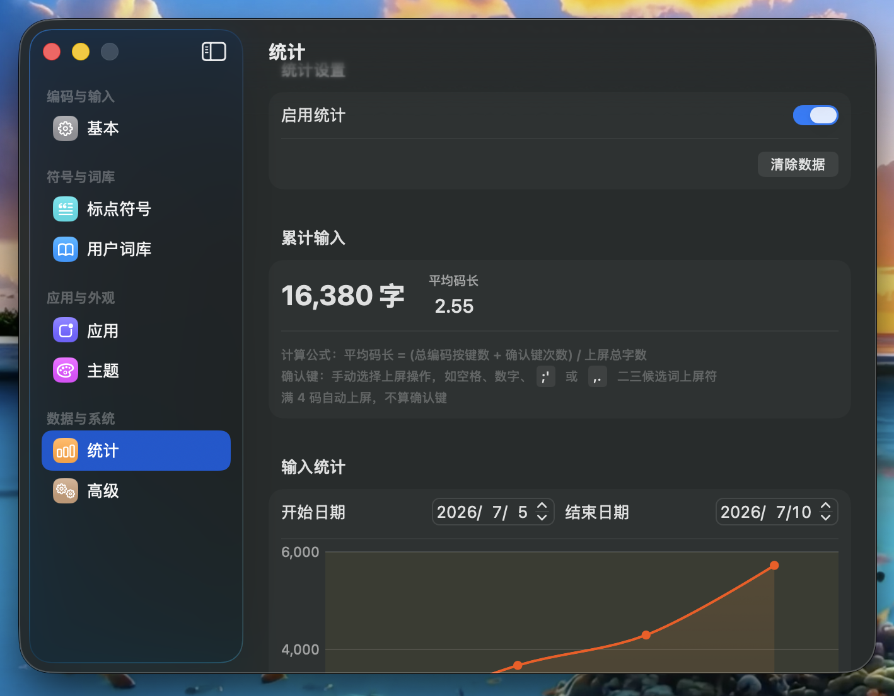

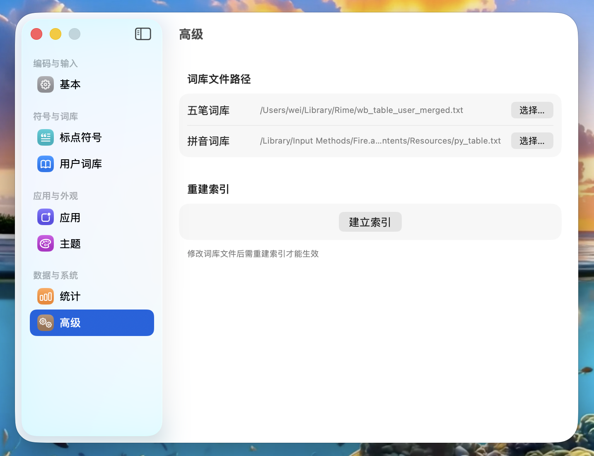


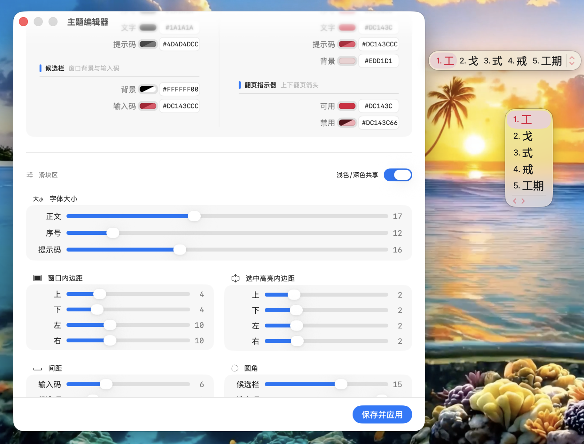

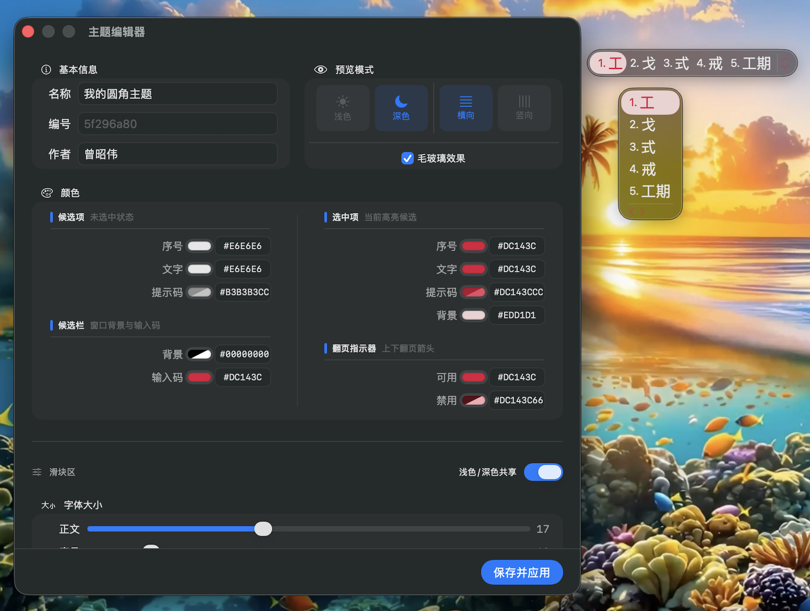

## 功能
1. 五笔输入(支持86版/98版/自定义编码方案)
2. 五笔拼音混输，支持编码提示
3. 纯拼音输入
4. -/+/向上/向下键支持翻页
5. z键查询
6. 候选词横向/竖向排列支持
7. 候选词数量可配置
8. 候选窗口显示输入编码
9. 应用输入模式切换
10. 支持手动调整候选词顺序(`control` + `数字`)
11. 支持用户词库
12. 支持自定义符号
13. 支持自定义主题
14. 支持数据统计
15. 支持临时英文模式(在中文输入模式下，按;键可以开启临时英文模式，输入英文字符和半角符号)
16. 快速组词(连续输入多个单字或词后，按`control` + `=`可将最近的输入自动组合成新词)
17. 快速删除候选词(`control` + `shift` + `数字`将对应候选词从词库删除)
18. 命令行

===========

## 重构说明
全面重构偏好设置系统、候选窗口、码表引擎和主题编辑器

- **偏好设置**：移除 Settings SPM 依赖，迁移至原生 SwiftUI，实现 macOS 26 Tahoe的新界面风格 **“Liquid Glass”**侧栏窗口布局
- **候选窗口**：添加鼠标悬停选中点击上屏、方向键移动选中项、毛玻璃背景、选中项背景高亮
- **主题系统**：新增内置主题编辑器支持实时预览、支持导入多主题管理
- **码表引擎**：新增精确匹配、生僻字过滤、增加五笔拆字(86/98/06)和拼音音调提示，拆字提示支持用户词；删除候选码改为屏蔽机制。
- **打字统计**：新增平均码长统计
- **输入处理**：新增第五码顶字上屏
- **码表构建**：五笔拆字注入，支持多字词组合拆字预计算
- **新功能**：新增五笔字根表查看(86/98/06)，新增支持用户自定义热键修饰键，解决 VS Code、Sublime Text 等应用拦截热键导致业火五笔快捷键失效的问题
- **上屏特效**：新增候选词上屏时，触发选定的庆祝效果，支持多种庆祝粒子动画（鲜花、星星、气球、泡泡、喷火、爱心、蝴蝶、音符、彩纸、鸡蛋

## 命令行使用

```bash
# 输出当前输入模式
/Library/Input\ Methods/Fire.app/Contents/MacOS/Fire --get-mode

# 设置输入模式并显示提示
/Library/Input\ Methods/Fire.app/Contents/MacOS/Fire --set-mode enUS 或 zhhans

# 设置输入模式不显示提示
/Library/Input\ Methods/Fire.app/Contents/MacOS/Fire --set-mode enUS 或 zhhans false
```

## 安装
> [下载地址](https://github.com/qwertyyb/Fire/releases)

1. 下载 `FireInstall.pkg` 文件到本地

2. 点击安装后使用


## 安装遇到问题
1. 没有自动切换到该输入法。
    > 可以在设置->键盘->输入法中添加此输入法

2. 输入法中没有此输入法。
    > 重启设备即可


## 开发
```bash
# 下载项目到本地
git clone --recursive https://github.com/qwertyyb/Fire.git

# 构建 sqlcipher
./scripts/0_prepare_sqlcipher.sh

# 使用Xcode打开项目启动开发
open Fire.xcodeproj

# 由于调试时，APP运行目录在/Library/Input Methods, 所以需要添加权限
sudo chmod -R 777 /Library/Input Methods
```


## License
[](https://app.fossa.com/projects/git%2Bgithub.com%2Fqwertyyb%2FFire?ref=badge_large)
